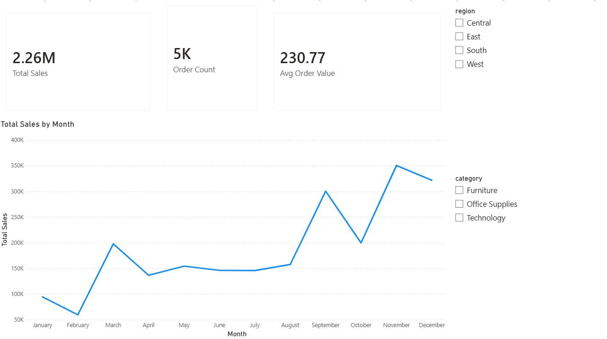
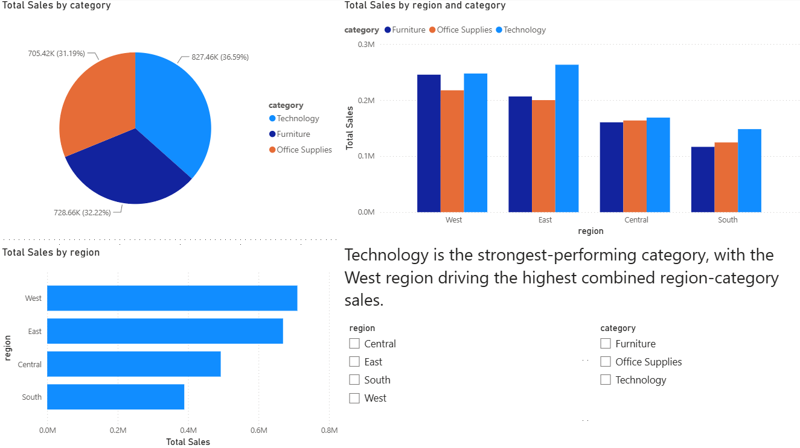
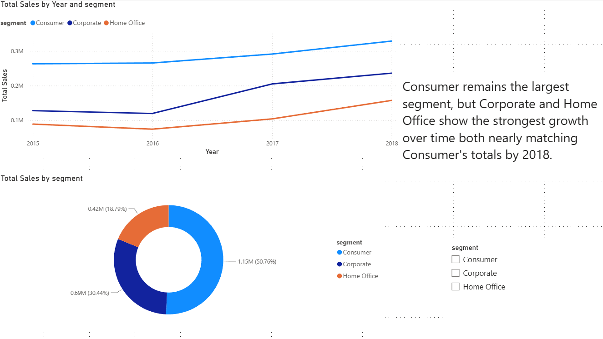
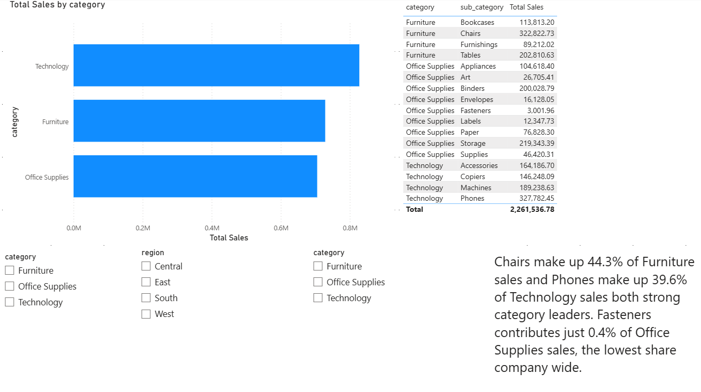

# Retail Sales Performance Analysis

## What This Project Is
I wanted a project that actually mirrors what a real Data Analyst role looks like, not just cleaning a spreadsheet, but starting from a business question and working all the way through to a dashboard someone could actually use. So I picked a retail sales dataset and treated it like a stakeholder had asked me: "why did performance vary across regions, categories, and customer segments, and where should we focus next quarter?"

## Data Source
[Sales Forecasting dataset](https://www.kaggle.com/datasets/rohitsahoo/sales-forecasting) from Kaggle, about 9,800 rows of multi-year US retail transactions. Column details are in `data/data_dictionary.md`.

## How I Worked Through It
1. Loaded the raw CSV into a PostgreSQL database (hosted on Supabase)
2. Explored it with SQL first to actually understand what I was working with, see `sql/01_exploration.sql`
3. Cleaned it up in SQL: fixed the date formatting (the source dates were day/month/year, not month/day/year, which would've thrown off any time-based analysis if I'd missed it), confirmed there were no duplicate rows, and documented 11 missing Postal Codes (all from Burlington, VT) rather than guessing values to fill them in, see `sql/02_cleaning.sql`
4. Wrote SQL queries to answer the actual business questions I set out to investigate, see `sql/03_business_questions.sql`
5. Connected Power BI to the cleaned data (via ODBC) and built an interactive dashboard with custom DAX measures for Total Sales, Average Order Value, and Order Count

## What I Found

**Seasonality:** Sales consistently spike in Q4. October through December outperform every other stretch of the year, with November standing out as the single strongest month, peaking even higher in the most recent year in the data.

**Regional & Category Performance:** Technology is the strongest category as well as the West region, both driving highest combined region category sales.

**Customer Segments:** Consumer is the biggest segment by far and stays on top every year, but Corporate and Home Office are both growing steadily and closing the gap over time.

**Sub-Categories:** Chairs make up 44.3% of all Furniture sales, and Phones make up 39.6% of Technology sales, both clear leaders in their categories. On the other end, Fasteners is only 0.4% of Office Supplies sales, by far the lowest of anything in the dataset. I can't tell from Sales alone whether that's just a naturally cheap, low-ticket item or an actual underperformer, worth flagging either way.

## If I Were Presenting This to a Business
1. **Lean into Q4.** Inventory and marketing should ramp up ahead of the holiday stretch instead of staying flat all year.
2. **Corporate and Home Office are worth more attention.** They're growing faster than Consumer, which is already maxed out as the dominant segment.
3. **Take a closer look at Fasteners.** Figure out if it's just a low-price item or something actually worth fixing.

## Dashboard

## Tools I Used
- PostgreSQL (via Supabase) for storing and querying the data
- SQL for all the cleaning, exploring, and analysis
- Power BI (connected via ODBC) for the data model, DAX measures, and dashboard
- Git/GitHub to track my work and document the whole process

## What I'd Add If I Kept Going
- A revenue forecast using Power BI's built-in forecasting
- A profit/margin estimate, if I find a version of this dataset that actually includes it
- A Tableau version of the same dashboard, just to compare the two tools side by side